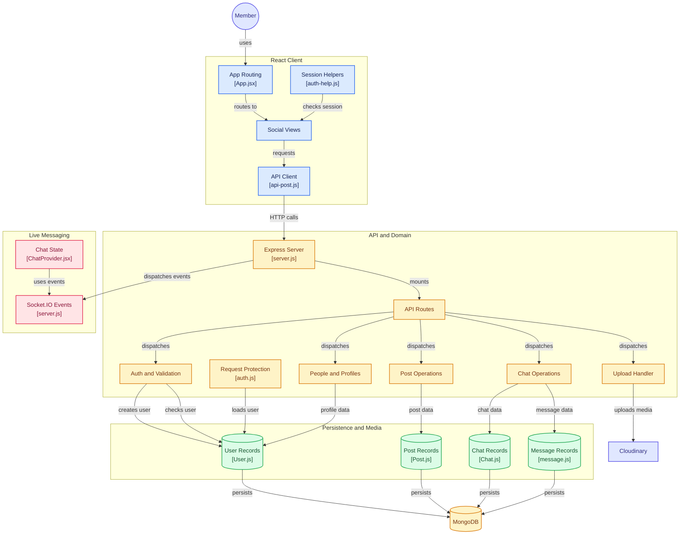

# 🏗️ Social Media App — System Architecture

This document describes the architecture, major components, data flow, authentication system, post management, chat system, real-time communication, and media upload flow of the **Social Media App**.

---

## 📌 Architecture Overview

The application is organized into four major layers:

1. **React Client** — User interface and client-side state
2. **API and Domain Layer** — Express server, routes, controllers and middleware
3. **Persistence and Media Layer** — MongoDB and Cloudinary
4. **Real-Time Messaging Layer** — Socket.IO and chat state



---

# 🖥️ 1. React Client

The frontend is built using **React** and provides the user-facing social media interface.

The major client-side components are:

| Component       | File               | Responsibility                                    |
| --------------- | ------------------ | ------------------------------------------------- |
| App Routing     | `App.jsx`          | Controls frontend navigation                      |
| Social Views    | `component/`       | Displays social media pages and UI                |
| API Client      | `api-post.js`      | Handles API communication                         |
| Session Helpers | `auth-help.js`     | Handles authentication/session-related operations |
| Chat State      | `ChatProvider.jsx` | Manages chat-related client state                 |

The basic frontend flow is:

```text
Member
   ↓
App.jsx
   ↓
Social Views
   ↓
API Client
   ↓
Express Server
```

---

# 🔐 2. Authentication

Authentication is handled through the frontend session helpers and backend authentication controllers.

The general flow is:

```text
User
  ↓
Login / Register UI
  ↓
auth-help.js
  ↓
HTTP Request
  ↓
Express Server
  ↓
API Routes
  ↓
Auth Controller
  ↓
User Schema
  ↓
MongoDB
```

The application uses authentication information to identify users and protect restricted operations.

---

# 🛡️ 3. Request Protection Middleware

The backend contains authentication middleware:

```text
middleware/auth.js
```

The middleware is responsible for validating authenticated requests and loading the corresponding user information.

Simplified flow:

```text
Client Request
      ↓
Authentication Information
      ↓
auth.js
      ↓
User Record
      ↓
Protected Controller
```

This prevents unauthorized users from accessing protected operations.

---

# ⚙️ 4. Express Backend

The backend is powered by **Node.js and Express.js**.

The main backend entry point is:

```text
server.js
```

The backend acts as the central API layer between the React frontend, MongoDB, Cloudinary and real-time Socket.IO communication.

```text
React Client
      ↓
Express Server
      ↓
API Routes
      ↓
Controllers
      ↓
Database / Cloudinary
```

---

# 🛣️ 5. API Routes

API routes define the application's backend endpoints.

```text
Routes/api/
```

Routes receive HTTP requests and dispatch them to the appropriate controllers.

For example:

```text
HTTP Request
     ↓
API Route
     ↓
Controller
     ↓
Database / Service
```

The route layer keeps endpoint definitions separate from the actual business logic.

---

# 👥 6. User and Profile Operations

User-related functionality is handled through the user controllers and `User.js` schema.

The system manages information related to:

* User accounts
* User profiles
* User information
* Social connections / profile-related operations

The flow is:

```text
Social View
    ↓
API Request
    ↓
User Controller
    ↓
User.js
    ↓
MongoDB
```

---

# 📝 7. Post Management

Post operations are handled by the Posts controllers and `Post.js` schema.

The application can perform post-related operations such as:

* Creating posts
* Retrieving posts
* Updating post information
* Managing post-related data

The architecture is:

```text
React Social View
       ↓
API Client
       ↓
Post Route
       ↓
Post Controller
       ↓
Post.js
       ↓
MongoDB
```

---

# 💬 8. Chat System

The application contains a chat system consisting of chat and message data.

Two important schemas are:

```text
Chat.js
message.js
```

The architecture separates chat-level information from individual message records.

```text
Chat Operations
      │
      ├──► Chat.js
      │
      └──► message.js
                │
                ▼
             MongoDB
```

This allows the application to persist conversations and individual messages.

---

# ⚡ 9. Real-Time Messaging

Real-time communication is handled using **Socket.IO**.

Socket.IO events are managed from:

```text
server.js
```

The frontend chat state is managed through:

```text
ChatProvider.jsx
```

The simplified communication flow is:

```text
User A
   ↓
ChatProvider
   ↓
Socket.IO
   ↓
Express / Socket Server
   ↓
Socket.IO
   ↓
ChatProvider
   ↓
User B
```

This allows messages and chat-related events to be delivered without requiring the page to continuously refresh.

---

# ☁️ 10. Media Uploads

Media uploads are handled separately from normal database operations.

The upload flow uses:

```text
uploadController.js
```

and **Cloudinary** for media storage.

The general flow is:

```text
React Client
      ↓
Upload Request
      ↓
Upload Controller
      ↓
Cloudinary
      ↓
Media URL
      ↓
Application / Database
```

Cloudinary is used for storing uploaded media instead of storing large media files directly inside MongoDB.

---

# 🗄️ 11. MongoDB Persistence

MongoDB is the primary persistent database.

The application uses separate schemas for different types of data:

```text
MongoDB
  │
  ├── User Records
  │      └── User.js
  │
  ├── Post Records
  │      └── Post.js
  │
  ├── Chat Records
  │      └── Chat.js
  │
  └── Message Records
         └── message.js
```

This separation keeps the application's data models organized according to their responsibilities.

---

# 🔄 12. Complete API Request Flow

A normal API request follows this architecture:

```text
React Component
      ↓
API Client
      ↓
HTTP Request
      ↓
Express Server
      ↓
API Route
      ↓
Authentication Middleware
      ↓
Controller
      ↓
Schema / Database
      ↓
MongoDB
      ↓
HTTP Response
      ↓
React UI
```

---

# 📝 13. Complete Post Creation Flow

A simplified post creation flow is:

```text
User
 ↓
Create Post UI
 ↓
API Client
 ↓
Post Route
 ↓
Authentication Middleware
 ↓
Post Controller
 ↓
Post.js
 ↓
MongoDB
 ↓
Response
 ↓
React UI
```

If media is attached:

```text
Post UI
   ↓
Upload Handler
   ↓
Cloudinary
   ↓
Media URL
   ↓
Post Data
   ↓
MongoDB
```

---

# 💬 14. Complete Chat Flow

The chat system combines persistent storage and real-time communication.

### Sending a message

```text
User A
   ↓
Chat UI
   ↓
ChatProvider
   ↓
Socket.IO
   ↓
Other User
```

### Persisting chat data

```text
Chat Operation
      ↓
Chat Controller
      ↓
Chat.js / message.js
      ↓
MongoDB
```

Therefore, the application uses:

* **Socket.IO** for real-time delivery
* **MongoDB** for persistent chat/message data

---

# 🧩 15. Technology Architecture

```text
                    SOCIAL MEDIA APP
                           │
          ┌────────────────┼────────────────┐
          │                │                │
       Frontend          Backend          Storage
          │                │                │
        React           Node.js          MongoDB
          │             Express.js
          │                │
     React Views       Controllers
          │                │
      API Client       Middleware
          │                │
          │          ┌─────┴─────┐
          │          │           │
          │       Socket.IO   Cloudinary
          │          │           │
          │       Real-time    Media
          │          Chat       Storage
          │
     ChatProvider
```

---

# 🛠️ 16. Technology Stack

### Frontend

* React
* React Router
* Axios / API client
* React Context API
* Socket.IO Client
* HTML
* CSS
* JavaScript

### Backend

* Node.js
* Express.js
* Socket.IO
* Authentication Middleware
* REST APIs

### Database

* MongoDB
* Mongoose schemas

### Media Storage

* Cloudinary

### Real-Time Communication

* Socket.IO

---

# 📁 17. Important Project Structure

```text
social-media-app/
│
├── FrontEnd/
│   └── src/
│       ├── component/
│       │   └── App.jsx
│       │
│       ├── api/
│       │   └── api-post.js
│       │
│       ├── auth/
│       │   └── auth-help.js
│       │
│       └── Context/
│           └── ChatProvider.jsx
│
├── Controllers/
│   ├── auth/
│   ├── Posts/
│   ├── users/
│   ├── chat/
│   └── upload/
│       └── uploadController.js
│
├── Routes/
│   └── api/
│
├── Schema/
│   ├── User.js
│   ├── Post.js
│   ├── Chat.js
│   └── message.js
│
├── middleware/
│   └── auth.js
│
├── server.js
│
└── docs/
    └── architecture.md
```

---

# 🔗 18. Important Source Files

### Frontend

* [App.jsx](https://github.com/yrpyash22/socila-media-plateform/blob/main/FrontEnd/src/component/App.jsx)
* [Frontend Components](https://github.com/yrpyash22/socila-media-plateform/tree/main/FrontEnd/src/component)
* [API Client](https://github.com/yrpyash22/socila-media-plateform/blob/main/FrontEnd/src/api/api-post.js)
* [Authentication Helper](https://github.com/yrpyash22/socila-media-plateform/blob/main/FrontEnd/src/auth/auth-help.js)
* [ChatProvider.jsx](https://github.com/yrpyash22/socila-media-plateform/blob/main/FrontEnd/src/Context/ChatProvider.jsx)

### Backend

* [server.js](https://github.com/yrpyash22/socila-media-plateform/blob/main/server.js)
* [API Routes](https://github.com/yrpyash22/socila-media-plateform/tree/main/Routes/api)
* [Authentication Controllers](https://github.com/yrpyash22/socila-media-plateform/tree/main/Controllers/auth)
* [Post Controllers](https://github.com/yrpyash22/socila-media-plateform/tree/main/Controllers/Posts)
* [User Controllers](https://github.com/yrpyash22/socila-media-plateform/tree/main/Controllers/users)
* [Chat Controllers](https://github.com/yrpyash22/socila-media-plateform/tree/main/Controllers/chat)
* [Upload Controller](https://github.com/yrpyash22/socila-media-plateform/blob/main/Controllers/upload/uploadController.js)
* [Authentication Middleware](https://github.com/yrpyash22/socila-media-plateform/blob/main/middleware/auth.js)

### Database Schemas

* [User.js](https://github.com/yrpyash22/socila-media-plateform/blob/main/Schema/User.js)
* [Post.js](https://github.com/yrpyash22/socila-media-plateform/blob/main/Schema/Post.js)
* [Chat.js](https://github.com/yrpyash22/socila-media-plateform/blob/main/Schema/Chat.js)
* [message.js](https://github.com/yrpyash22/socila-media-plateform/blob/main/Schema/message.js)

---

# 🎯 19. Architecture Summary

The application uses different technologies for different responsibilities:

| Technology                    | Responsibility                      |
| ----------------------------- | ----------------------------------- |
| **React**                     | User interface and frontend routing |
| **REST API**                  | Client-server communication         |
| **Express.js**                | Backend API server                  |
| **Authentication Middleware** | Protecting requests                 |
| **MongoDB**                   | Persistent application data         |
| **Socket.IO**                 | Real-time messaging                 |
| **Cloudinary**                | Media/file storage                  |
| **React Context**             | Client-side chat/session state      |

The complete architecture can be summarized as:

```text
                    React Client
                         │
                         │ HTTP
                         ▼
                  Express Server
                         │
             ┌───────────┼───────────┐
             │           │           │
             ▼           ▼           ▼
         Controllers   Socket.IO   Upload
             │           │           │
             ▼           ▼           ▼
          MongoDB    Real-time    Cloudinary
             │         Chat
             ▼
        Persistent Data
```

The architecture separates **UI, API logic, authentication, database persistence, real-time communication, and media storage**, making the application easier to maintain and extend.
